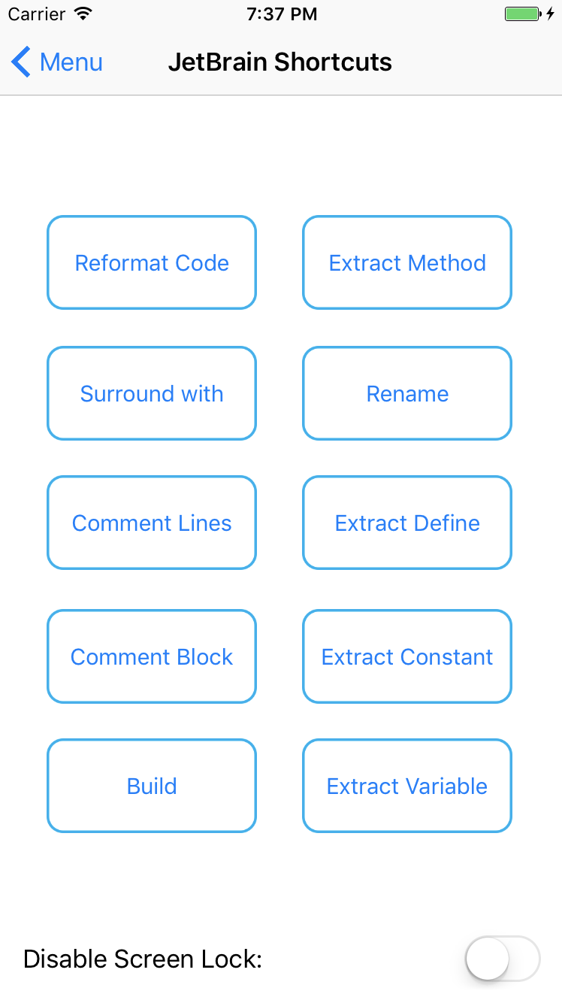

### TouchMore - Turn your iOS device into extended keyboard

TouchMore is an iOS application that provide numerical pad and useful JetBrain shortcuts. You can also customize your own needed shortcuts.

For connection, an application named TouchMoreReceiver is required on macOS. Meanwhile, the devices should be in the same Wi-Fi local network or connected by wires.

 
 

Peiyuan Qi 2017
